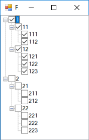
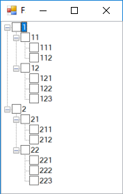
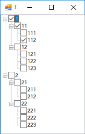

# TreeView Check or UnCheck Hierarchy

In this example I'll show how to check or uncheck hierary of nodes, to satisfy this requiremet:

When you check/uncheck a node:

- All descendants of that node should change to the same check state.

- All nodes in ancestors, should be checked if there is at list one child in their descendants checked, otherwise, should be unchecked.

**Example**

Initial state

Check Node 1

Uncheck Node 11

Check Node 112

